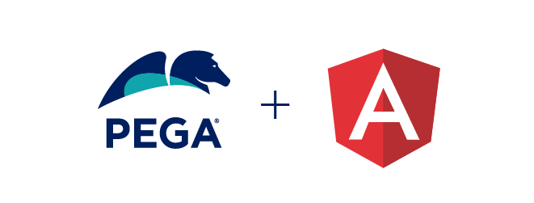

<p align="center">

# Angular SDK

The **Angular SDK** provides Pega customers with the ability to build DX components that connect Pega’s ConstellationJS Engine APIs with a design system other than Pega Cosmos.

The Angular SDK differs from out-of-the-box Constellation design system because it provides and demonstrates the use of a design system that is not the Pega **Constellation** design system. The alternative design system used in this Angular SDK is 
 [Angular Material](https://material.angular.io/) - open-source components that integrate seamlessly with Angular.

The Angular SDK is built on a new and modernized UI technology stack (the Constellation JavaScript Engine and Constellation JavaScript API). Many additional SDK features are planned for 2022 to expand the scope of supported use cases.

<br>

# Prerequisites

## Pega Infinity Server and Constellation architecture-enabled Application

This version of the Angular SDK assumes that you have access to a Pega Infinity server (**8.8.0+ GA or 8.7.0+ GA**) running an application that is configured to run using the Constellation UI service.

The **MediaCo** sample application is already configured as a Constellation architecture-based application and can be found in the Angular SDK download associated with this repo which is available at [https://community.pega.com/marketplace/components/angular-sdk](https://community.pega.com/marketplace/components/angular-sdk). The OAuth 2.0 Client Registration records associated with the **MediaCo** application are available in the same Angular SDK download. For more information about the MediaCo sample application, see [MediaCo sample application](https://docs-previous.pega.com/constellation-sdks/mediaco-sample-application).

The **Angular SDK** has been tested with:
- node 18.12.1/18.13.0
- npm 8.19.2/8.19.3 

Future updates to the SDK will support more recent LTS versions of node as the Constellation architecture supports them.

**Before** installing and running the SDK code, refer to the **Angular SDK Guide** provided in the Marketplace download for steps to prepare your Infinity server and node environment so you can proceed with the steps in the next section.

<br>

---
# Installing and Running the Application
The following procedures provide an overview of installing Constellation SDKs and running the application. For detailed documentation, see [Installing and configuring Constellation SDKs](https://docs.pega.com/bundle/constellation-sdk/page/constellation-sdks/sdks/installing-configuring-constellation-sdks.html).

### **Install** the Angular SDK

1. Install

    ```
    $ cd <kit location>

    (This next step is strongly recommended if you have a node_modules directory installed from an earlier version of the kit)
    $ rm node_modules

    $ npm install
    ```

### **Configure** the Angular SDK

2. Edit **sdk-config.js** and, if necessary, update the values that will be used. For more information about the attributes in the **sdk-config.json** file, see [Configuring the sdk-config.json file](https://docs-previous.pega.com/constellation-sdks/configuring-sdk-configjson-file)

    * The **authConfig** section contains values for the information you obtained earlier from OAuth: the Client ID, endpoints, etc.<br><br>
      * **Note:** it is **required** that you configure a value for **authConfig.mashupClientSecret**.
      * Navigate to Records / Security / OAuth 2.0 Client Registration landing page and open the `MediaCoOauthNoLogin` record
      * Click the **Regenerate Client Secret** button, download the Client Credentials (as the ClientID and Secret values will be needed), and save the record.
      * Then, use the generated **Client Secret** value as the value for**authConfig.mashupClientSecret**. (The ClientID value should remain unchanged.)
      <br><br>
   * The **serverConfig** section contains values related to the Pega Infinity server and SDK Content Server.
   <br><br>

3. Edit the **package.json** file's dependency for **[@pega/constellationjs](https://www.npmjs.com/package/@pega/constellationjs)** with the **tag name** that is appropriate for the Pega Infinity version that your application is running. For example, Infinity 8.8.0 uses the tag "**SDK-8.8.0**", Infinity 8.7.3 uses the tag "**SDK-8.7.3**", etc. You must **always** use the appropriate Constellation architecture files that match your Infinity deployment.
<br><br>


### **Run** the application

4. **Development build and start**

    4.1 Full development clean and install of npm modules, and build; then start the server
   ```
   $ npm run build:dev:ci
   $ npm run start-dev (or start-dev-https)
   ```
   or <br>

    4.2 Build without clean and install (assumes npm install has already been run)
   ```
   $ npm run build:dev
   $ npm run start-dev (or npm run start-dev-https)
   ```
   or <br>

    4.3 Build without clean and install and enable live reload (compiles and reloads the page whenever a project file is saved during development; assumes npm install has already been run)
   ```
   $ npm run ng serve
   ```

5. **Production build and start**

    5.1 Full production clean and install of npm modules, and build; then start the server. (Building in production mode
    generates gzip and Brotli compressed versions of the static content. Serving in production mode will serve the
    gzip or Brotli static content when available.)

   ```
   $ npm run build:prod:ci
   $ npm run start-prod (or start-prod-https)
   ```
   or <br>

    5.2 Build without clean and install (assumes npm install has already been run)
   ```
   $ npm run build:prod
   $ npm run start-prod (or start-prod-https)
   ```


### **Access** the sample application from your browser

6. **Embedded** (formerly known as Mashup)

    6.1 Access **http://localhost:3500/embedded** or **https://localhost:3500/embedded** (if ```run start-https``` is used)

7.  **Portal**

    7.1 Access **http://localhost:3500/portal** or **https://localhost:3500/portal** (if ```run start-https``` is used)

    **If you see a blank page**, check your JavaScript console to see if you have encountered a net::ERR_CERT_INVALID error. If you encounter this error, see the troubleshooting section below: **Runtime Error: net::ERR_CERT_INVALID**. Due to browser interactions during login, it can be easier to find and fix this error using the Portal URL.

Note that the examples above are for the default configuration. If you change the configuration to use a different host and/or port, adapt these URLs to your host:port as necessary.

<br>

---

## Testing the application
<br>

You can test both **Portal** and **Embedded** scenarios by executing the following commands in the terminal:

1. ```
   $ npm run build:dev:ci
   ```

2. ```
   $ npm run start-dev (and leave it running)
   ```

3. Open a different terminal window or tab (since start-dev is still running)

4.  **Executing the tests**:

    4.1 Execute the Portal test-
      ```
      $ npm run test -- portal
      ```

      or <br>

    4.2 Execute the Embedded test:
      ```
      $ npm run test -- embedded
      ```

      or <br>

    4.3 Execute both tests simultaneously-
      ```
      $ npm run test
      ```

   <br>

5. **Getting the test report**:

   To get the test report of last run:

   ```
   npx playwright show-report
   ```

> **NOTE**: These tests execute the sample **MediaCo** application.

<br>

---

## Some setup and troubleshooting tips
<br>


> **NOTE**: These setup tips are abstracted from the Angular SDK Guide that is available at [https://community.pega.com/media/angular-sdk-user-guide-87](https://community.pega.com/media/angular-sdk-user-guide-87). For more information about troubleshooting, see [Troubleshooting the Constellation SDKs](https://docs-previous.pega.com/constellation-sdks/troubleshooting-constellation-sdks).

<br>

### Verify/update Cross Origin Resource Sharing (CORS) Infinity record

The **APIHeadersAllowed** record on your Infinity server (found in Security | Cross Origin Resource Sharing) may need to be updated to allow the Angular SDK calls to Pega REST APIs and DX APIs to interact with Infinity.

For the **APIHeadersAllowed** CORS record, confirm or update the record as follows:

* **Allowed methods**
  * **All 5 methods** should be checked:
  **GET, POST, PUT, PATCH, and DELETE**

* **Allowed headers**
  * The list of allowed request header should include the following:
  **authorization, content-type, Access-Control-Expose-Headers, If-Match, pzCTKn, context, remotesystemid**

* Exposed headers
  * The list of allowed exposed headers should include the following:
  **etag, remotesystemid**

* **Save** the record - **APIHeadersAllowed** – after making any changes.

<br>

### Runtime Error: net::ERR_CERT_INVALID

Browsers are less tolerant of local, self-signed certificates or when no local, self-signed certificate exists. If you don’t have a trusted self-signed certificate and launch your application, you may see a blank screen accompanied by an error similar to this in your JS console:

POST https://localhost:1080/prweb/PRRestService/oauth2/v1/token **net::ERR_CERT_INVALID**

Typically, you can resolve this error by indicating to your browser that you are willing to trust the local certificate that’s being used. Here are a few links that we’ve found useful for solving this problem for various browsers:

* https://kinsta.com/knowledgebase/neterr-cert-authority-invalid/

* https://stackoverflow.com/questions/65816432/disable-any-cert-check-on-localhost-on-chrome

* In Chrome, Brave, or Edge, you can temporarily resolve this error by enabling the “Allow invalid certificates for resources loaded from localhost using this URL:
[chrome://flags/#allow-insecure-localhost](chrome://flags/#allow-insecure-localhost)


<br>

---

### Verify/update OAuth 2.0 Client Registration Infinity records

The MediaCo sample application (available to Pega licensed users) includes OAuth Client Registration records that it uses for authentication in your Infinity server (available in Security | OAuth 2.0 Client Registration): **MediaCoOauthNoLogin** (for the Embedded use case) and **MediaCoOauth** (for the Portal use case).

You may use these records. If you want to create your own OAuth 2.0 Client Registration record, refer to the **How to create OAuth2 registration in Infinity** section below.

* For the **Embedded** use case, you will use the OAuth 2.0 Client Registration record’s **Client ID** and **Client secret** as the values for **mashupClientId** and **mashupClientSecret** in the SDK’s **sdk-config.js** file.

* For the **Portal** use case, you will use the OAuth 2.0 Client Registration record’s **Client ID** as the value of **portalClientId** in the SDK’s **sdk-config.js** file.


To ensure that the application is redirected to the proper page after authentication succeeds, you may need to update the OAuth 2.0 Client Registration record’s **List of redirect URIs** shown in the record’s **Supported grant types** section.

The MediaCoOauth and MediaCoOauthNoLogin records that are included with the MediaCo sample application include the necessary redirect URIs for the default configuration:

* http://localhost:3500/portal and https://localhost:3500/portal for the Portal use case

*	http://localhost:3500/auth.html and https://localhost:3500/auth.html for the Embedded use case

If you configure your installation to have the Angular SDK static content served from a different **host:port** than the default, you should add new Redirect URIs to the list:

* In the **Supported grant types** section add the following URLS to the list of redirect URLs by clicking on the + sign. (Note that the default port is 3500.)

  * http://\<**host name or IP address of Angular SDK server**>:<**port you’re using**>/portal (for the portal use case)

  * https://\<**host name or IP address of Angular SDK server**>:<**port you’re using**>/portal (for the portal use case)

  * http://\<**host name or IP address of Angular SDK server**>:<**port you’re using**>/auth.html

  * https://\<**host name or IP address of Angular SDK server**>:<**port you’re using**>/auth.html

  * Note that entries are needed for either **http** or **https** depending on how you access your Angular SDK server

 * **Save** the record

<br>

---

### How to create an OAuth 2.0 Client Registration record in Infinity

If the `MediaCo` app was imported to your Infinity server, a `MediaCoOAuth` OAuth 2.0 Client Registration record will have been imported as well. That record's clientId is currently referenced within sdk-config.json. However, you can create your own OAuth 2.0 Client Registration record using the following procedure:
   * Create a new "Security/OAuth 2.0 Client Registration" record for your app
   * You might name it the same name as your application
   * Specify "Public" for the type of client (as browser apps are not able to prevent any "Client secret" from being compromised)
   * Select "Authorization Code" for the Grant type
   * Add a RedirectURI value based on the url used to access the deployed Angular SDK (e.g., http://localhost:3500/auth.html)
   * Enable the "Enable proof code for pkce" option
   * Set the "Access token lifetime" for how long you want the logged-in session to last. Pega does not presently support the ability to refresh the token (for Public clients), so the user will have to reauthenticate again after this interval.
   * Enter the appropriate values within **sdk-config.json**

<br>

---

### Setting up a secure self-signed certificate for localhost


The following steps will enable setting up a secure self-signed certificate for localhost (adapted from the procedure outlined here: https://gist.github.com/pgilad/63ddb94e0691eebd502deee207ff62bd). At the end of the process two files are expected within the root project directory: private.pem and private.key

Step 1: Create a private key
   ```
   $ openssl genrsa -out private.key 4096
   ```


Step 2: Create a Certificate configuration text file named ssl.conf within the root project directory. Use the following (or adjusted content to reflect your location and desired organization):
   ```
[ req ]
default_bits       = 4096
distinguished_name = req_distinguished_name
req_extensions     = req_ext

[ req_distinguished_name ]
countryName                 = US
countryName_default         = US
stateOrProvinceName         = Massachusetts
stateOrProvinceName_default = Massachusetts
localityName                = Westford
localityName_default        = Westford
organizationName            = Pegasystems
organizationName_default    = Pegasystems
organizationalUnitName      = DXIL
organizationalUnitName_default = DXIL
commonName                  = localhost
commonName_max              = 64
commonName_default          = localhost

[ req_ext ]
subjectAltName = @alt_names

[alt_names]
DNS.1   = localhost
   ```

Step 3: Create a Certificate Signing Request (will be prompted for a passphrase for the new key)

   ```
   $ openssl req -new -sha256 -out private.csr -in private.key -config ssl.conf
   ```


Step 4: Generate the Certificate
   ```
   $ openssl x509 -req -sha256 -days 3650 -in private.csr -signkey private.key -out private.crt -extensions req_ext -extfile ssl.conf
   ```

Step 5: Add the Certificate to the keychain and trust it (will be prompted for Mac system password)
   ```
   $ sudo security add-trusted-cert -d -r trustRoot -k /Library/Keychains/System.keychain private.crt
   ```

Step 6: Create a pem file from crt
   ```
   $ openssl x509 -sha256 -in private.crt -out private.pem -outform PEM
   ```
Step 7: Run webpack server with arguments to use the keys (assumes private.pem and private.key are in the root project directory).  May need to close prior open instances of browser (if previously accessed prior insecure localhost)

   ```
   $ npm run localhostsecure
   ```
<br>

---

   ## License

This project is licensed under the terms of the **Apache 2** license.

>You can see the full license [here](LICENSE) or directly on [apache.org](https://www.apache.org/licenses/LICENSE-2.0).

<br>

---

## Contributing

We welcome contributions to the Angular SDK project.

Refer to our [guidelines for contributors](./docs/CONTRIBUTING.md) if you are interested in contributing to the project.

<br>


---

## Additional Resources
* [Angular](https://angular.io/)
* [Angular Material](https://material.angular.io/)
* [Constellation SDKs Documentation](https://docs-previous.pega.com/constellation-sdks/constellation-sdks)
* [Troubleshooting Constellation SDKs](https://docs-previous.pega.com/constellation-sdks/troubleshooting-constellation-sdks)
* [MediaCo sample application](https://docs-previous.pega.com/constellation-sdks/mediaco-sample-application)
